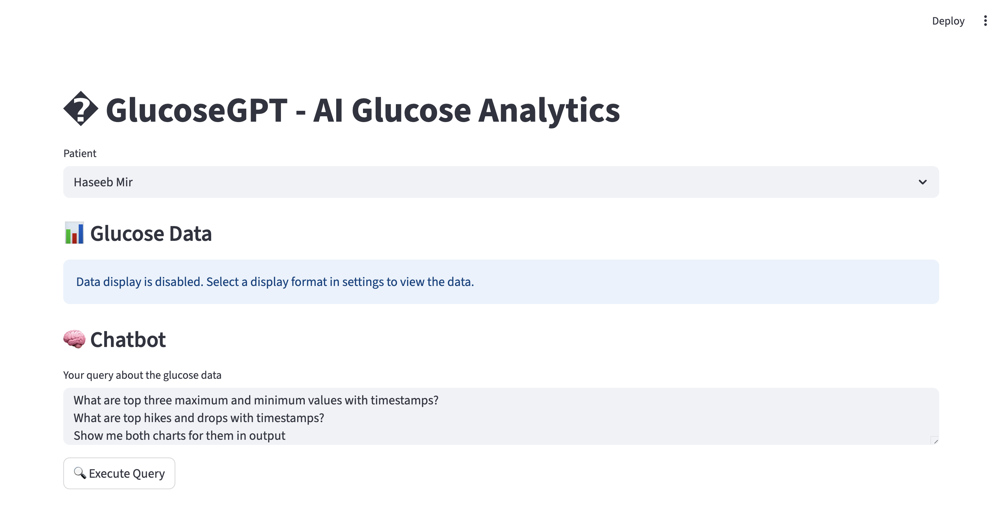
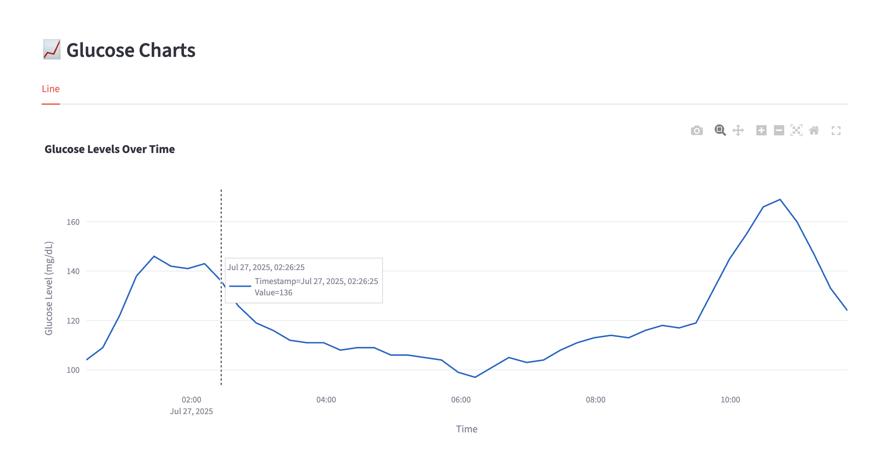

# Glucose-GPT - AI-Powered Glucose Monitoring Platform & SDK

A dual-purpose solution combining:
1. An intelligent chat application for glucose monitoring analysis using multiple AI models
2. A professional SDK for LibreView CGM system integration

This platform leverages multiple AI models (Gemini, GPT-4, Claude, etc.) through LiteLLM integration for advanced glucose data analysis, while providing a robust SDK for medical technology integration. Built following industry standards for reliability, security, and medical data handling.

[](https://www.gnu.org/licenses/gpl-3.0)
[]()
[]()

## Platform Features

### AI Chat Application
- **Multi-Model AI Support**: 
  - Google's Gemini (recommended and fully tested)
  - OpenAI's GPT-4/3.5 (untested)
  - Anthropic's Claude (untested)
  - Replicate's models (untested)
  - Cohere's models (untested)
- **LiteLLM Integration**: Unified interface for all AI models
- **Note**: Currently, only Google's Gemini models have been thoroughly tested
- **Streamlit Interface**: Rich, interactive web application
- **Advanced Analytics**: Real-time glucose pattern analysis
- **Customizable Experience**: Choose your preferred AI model
- **Intelligent Code Execution**: Automatically detects complex queries and runs Python code for advanced analysis
- **Real-time Query Detection**: Identifies complex queries that may benefit from code execution

### Medical Technology SDK
- **SOLID Principles**: Clean, modular, and maintainable code architecture
- **Security First**: Built-in sensitive data masking and secure communication
- **Audit Logging**: Comprehensive logging for medical compliance
- **Error Handling**: Robust error handling for medical-grade reliability
- **Type Safety**: Full type hints and runtime type checking
- **API Versioning**: Support for multiple API versions
- **Regional Compliance**: Built-in regional server support
- **Interactive Analysis**: Real-time glucose data analysis with AI insights

## Repository Structure

This repository maintains two main branches:
- `develop` - Development branch for active development and new features
- `main` - Stable release branch for production deployments

All development work should be done in feature branches branched from `develop` and merged back via pull requests.

## Available Clients

The library provides two different client implementations for different use cases:

### 1. LibreCGMClient
For direct integration with LibreView CGM devices:
```python
from glucosegpt import LibreCGMClient, ApiConfig

# Create configuration (optional, has defaults)
config = ApiConfig(
    version=os.getenv("LIBRE_VERSION", "4.7"),  # From environment or default
    product=os.getenv("LIBRE_PRODUCT", "ios"),  # From environment or default
    region="us",
    base_url="https://libreview-proxy.onrender.com"
)

# Initialize client with configuration
client = LibreCGMClient(
    email=os.getenv("LIBRE_USERNAME"),  # From environment
    password=os.getenv("LIBRE_PASSWORD"),  # From environment
    config=config  # Optional, will use defaults if not provided
)

# Authenticate
auth_data = client.authenticate()
```
- Endpoint: `/llu/auth/login`
- Method: POST
- Features:
  - Automatic regional server detection
  - Terms of service handling
  - Secure token management
  - Rate limiting protection

### User Management
```python
# Get user profile
user_data = client.get_current_user()

# Get account details
account_data = client.get_account()
```
- Endpoints:
  - `/user` (GET) - User profile
  - `/account` (GET) - Account details
- Features:
  - Sensitive data masking
  - Detailed user information
  - Account status tracking

### Patient Connections
```python
# List all connections
connections = client.list_connections()

# Get patient graph data
graph_data = client.get_patient_graph(patient_id="...")
```
- Endpoints:
  - `/llu/connections` (GET) - List connections
  - `/llu/connections/{id}/graph` (GET) - Patient glucose data
  - `/llu/connections/{id}/logbook` (GET) - Patient logbook
- Features:
  - Real-time glucose data
  - Historical data access
  - Trend analysis

### Glucose Data Analysis
```python
# Get patient glucose data
glucose_data = client.get_patient_graph(patient_id)

# Get logbook entries
logbook = client.get_patient_logbook(patient_id)
```
- Data Points:
  - Current glucose level
  - Historical trends
  - Time-series analysis
  - Alerts and warnings

### Notification Management
```python
settings = client.get_notification_settings(connection_id)
```
- Endpoint: `/llu/notifications/settings/{id}`
- Features:
  - Alert configuration
  - Threshold management
  - Notification preferences

### Regional Configuration
```python
config = client.get_country_config(country_code)
```
- Endpoint: `/llu/config/country`
- Features:
  - Regional settings
  - Compliance rules
  - Unit preferences

### 2. LibreLinkUpClient
For integration with LibreLinkUp sharing service:
```python
from glucosegpt import LibreLinkUpClient, LibreLinkUpConfig

# Create configuration
config = LibreLinkUpConfig(
    client_version="4.9.0",  # Optional, default shown
    base_url="https://api.libreview.io"  # Optional
)

# Initialize client
client = LibreLinkUpClient(
    username="user@example.com",
    password="****",
    config=config  # Optional
)

# Authenticate and get data
auth_data = client.authenticate()
connections = client.list_connections()
glucose_data = client.get_connection_graph(connection_id)
```

#### LibreLinkUp Features
- **Authentication**: Secure token-based authentication
- **Regional Support**: Both US and European server endpoints
- **Patient Connections**: List and manage patient connections
- **Glucose Data**: Real-time and historical CGM data
- **Connection Management**: Monitor multiple patients
- **Trend Analysis**: Access trend data and alerts

### Security Features
- Automatic token management
- Sensitive data masking
- Secure communication
- Rate limiting protection
- Audit logging

## Setup

1. Clone the repository:
```bash
git clone https://github.com/haseeb-heaven/LibreViewApp.git
cd LibreViewApp
```

2. Create a virtual environment (recommended):
```bash
python -m venv venv
source venv/bin/activate  # On Windows: venv\Scripts\activate
```

3. Copy the example environment file and configure it:
```bash
cp .env.example .env
```

Then edit the `.env` file with your credentials:
```bash
# LibreView Credentials (Required)
LIBRE_EMAIL=your.email@example.com      # Your LibreView account email
LIBRE_PASSWORD=your_password            # Your LibreView account password

# AI Model API Keys (At least one required)
GEMINI_API_KEY=your_gemini_key         # Google Gemini API key
OPENAI_API_KEY=your_openai_key         # OpenAI API key (optional)
ANTHROPIC_API_KEY=your_claude_key      # Anthropic Claude API key (optional)
COHERE_API_KEY=your_cohere_key        # Cohere API key (optional)
REPLICATE_API_KEY=your_replicate_key   # Replicate API key (optional)

# Optional API Configuration
LIBRE_VERSION=4.7                      # API version to use (default: 4.7)
LIBRE_PRODUCT=ios                      # Product type (ios or android)
DEFAULT_AI_MODEL=gemini-1.0-pro       # Default AI model to use
```

4. Install dependencies:
```bash
pip install -r requirements.txt
```

This will install all required packages:
- requests: For HTTP client functionality
- python-dotenv: For environment variable management
- typing-extensions: For enhanced type hints
- black: For code formatting
- pytest: For unit testing
- mypy: For static type checking

## Usage

### Running the AI Chat Application

1. Start the Streamlit interface:
```bash
streamlit run glucosegpt/examples/glucose_chat.py
```

2. The chat application provides:
   - Interactive AI-powered glucose analysis
   - Multiple AI model selection
   - Real-time data visualization
   - Pattern recognition and insights
   - Export capabilities for reports
   - **Automatic Testing**: Tests run automatically on first launch to ensure system integrity

### Using the SDK

1. For programmatic access:
```bash
python main.py
```

2. The SDK provides:
   - LibreView API integration
   - User profile management
   - Patient connections handling
   - Glucose data retrieval
   - AI analysis integration

3. Logs and Monitoring:
   - Console: Real-time progress and status
   - `logs/glucose_gpt_YYYYMMDD.log`: Detailed debug information
   - AI Analysis logs: Model interactions and responses

## API Documentation

This application uses the unofficial LibreView API as documented at [API Docs](https://libreview-unofficial.stoplight.io)

And for LibreLinkUp, the API documentation is available at [API Docs](https://gist.github.com/khskekec/6c13ba01b10d3018d816706a32ae8ab2)
The API provides:

- Regional server support
- Authentication and token management
- User profile and account management
- Patient connection handling
- Glucose data retrieval
- Real-time CGM data access

Note: This is a community-driven, unofficial implementation and is not affiliated with Abbott Diabetes Care, Inc.

## Testing

The application includes comprehensive testing infrastructure:

### Automatic Testing
- Tests run automatically when the Streamlit application is first launched
- Ensures system integrity and component functionality before user interaction
- Quick validation of core functionality without external dependencies

### Manual Testing
You can also run tests manually using:

```bash
# Run all simple unit tests
python -m pytest tests/test_libre_chat_simple.py -v

# Run integration tests (requires more setup)
python -m pytest tests/test_libre_chat_integration.py -v

# Run all tests with coverage
python -m pytest tests/ --cov=glucosegpt --cov-report=html

# Use the custom test runner
python run_tests.py
```

### Test Coverage
- **Unit Tests**: Core functionality without external dependencies
- **Integration Tests**: Full workflow testing with mocked external services
- **Data Processing**: Glucose data analysis and transformation
- **AI Integration**: LLM interaction and code execution
- **Error Handling**: Comprehensive error scenarios and edge cases

See `TESTING.md` for detailed testing documentation.

## Contributing

1. Fork the repository
2. Create your feature branch from `develop`: `git checkout -b feature/your-feature-name`
3. Commit your changes: `git commit -am 'Add some feature'`
4. Push to the branch: `git push origin feature/your-feature-name`
5. Submit a pull request to the `develop` branch

## License

This project is licensed under the GNU General Public License v3.0 - see the [LICENSE](LICENSE) file for details.

## AI Chat Application

Glucose-GPT provides an intelligent interface for glucose monitoring analysis:

### Quick Start
```bash
# Run the AI Chat application
streamlit run glucosegpt/examples/glucose_chat.py
```

### Screenshots

#### Streamlit Interface
The main interface provides an intuitive web-based experience for glucose data analysis:



#### AI-Powered Analysis
Advanced AI analysis with multiple model support and interactive visualizations:



### Features
- **Multiple AI Models**:
  - Switch between different AI models (Gemini, GPT-4, Claude, etc.)
  - Compare analyses from different models
  - Unified interface through LiteLLM

- **Interactive Analysis**:
  - Real-time glucose data visualization
  - AI-powered trend analysis
  - Pattern recognition
  - Anomaly detection
  - Predictive insights

- **Customization**:
  - Choose preferred AI model
  - Customize analysis parameters
  - Set personal glucose targets
  - Configure visualization preferences

- **Data Management**:
  - Export reports and analyses
  - Save AI conversations
  - Download visualizations
  - Share insights securely

### AI Model Configuration
```python
# Example of switching AI models
from litellm import completion

# Using Gemini
response = completion(
    model="gemini-1.0-pro",
    messages=[{"content": "Analyze glucose patterns"}]
)

# Using GPT-4
response = completion(
    model="gpt-4",
    messages=[{"content": "Identify glucose trends"}]
)

# Using Claude
response = completion(
    model="anthropic/claude-2",
    messages=[{"content": "Suggest glucose management strategies"}]
)
```

## Changelog

### Version 1.2.0 (2025-07-27)

AI Integration and Web Interface Update:
- Integrated Google's Gemini AI for advanced glucose data analysis
- Added Streamlit-based web interface for interactive data visualization
- Implemented real-time AI analysis of glucose patterns
- Added interactive query system for glucose data analysis
- Enhanced data visualization with Plotly integration
- Updated environment configuration for AI services
- Added comprehensive AI analysis documentation
- Improved error handling for AI services
- Added example scripts for AI-powered analysis

### Version 1.1.0 (2025-07-24)

Major Feature Update:
- Added new LibreLinkUp client for sharing service integration
- Reorganized project structure into proper Python package
- Created shared utilities for logging and data masking
- Added example scripts for both clients
- Updated environment configuration for both clients
- Improved project documentation
- Enhanced error handling and type safety

### Version 1.0.2 (2025-07-24)

Project Restructuring and Environment Management:
- Unified environment variables for both clients
- Added proper version and product handling for LibreLinkUp client
- Improved request header management with version and product info
- Enhanced debugging information for API requests
- Updated project structure with better organization
- Added comprehensive error logging for API responses
- Updated documentation with environment variable usage

### Version 1.0.1 (2025-07-23)

API and Code Quality Update:
- Refactored codebase to follow SOLID principles
- Added dependency injection with ApiConfig class
- Implemented Protocol-based interfaces for better modularity
- Enhanced error handling with detailed error messages
- Updated OpenAPI specification with improved examples
- Added comprehensive type hints and documentation
- Improved logging system with better data masking
- Added requirements.txt with development dependencies
- Created .env.example for better configuration management

### Version 1.0.0 (2025-07-23)

Initial release with following features:
- Implemented robust LibreView API client
- Added comprehensive logging with dual loggers (console and file)
- Implemented sensitive data masking
- Added user profile and account management
- Added patient connections handling
- Added glucose data retrieval
- Added error handling and session management
